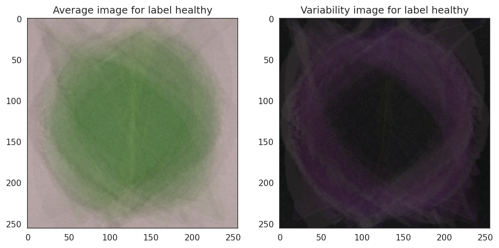
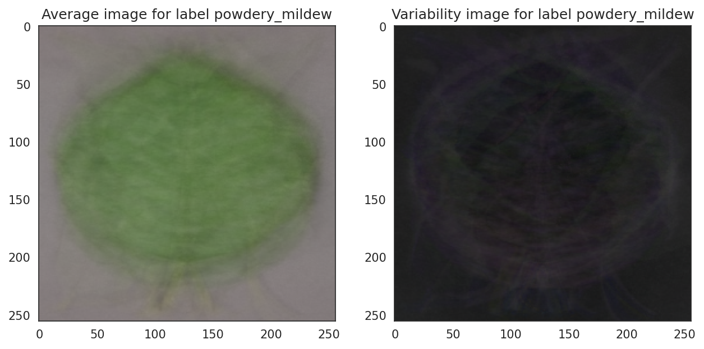

# **Powdery Mildew Detection In Cherry Leaves**

## Table of Contents

1. [Dataset Content](#dataset-content)
2. [Business Requirements](#business-requirements)
3. [Hypothesis and Validation](#hypothesis-and-validation)
4. [Business Rationale for the Model](#the-rationale-to-map-the-business-requirements-to-the-data-visualisations-and-ml-tasks)
5. [Business Case](#ml-business-case)
6. [Dashboard Design](#dashboard-design)
7. [Bugs](#bugs)
8. [Deployment](#deployment)
9. [Main ML Libraries](#main-data-analysis-and-machine-learning-libraries)
10. [Credits](#credits)

## Dataset Content

- The dataset is sourced from [Kaggle](https://www.kaggle.com/codeinstitute/cherry-leaves). We then created a fictitious user story where predictive analytics can be applied in a real project in the workplace.
- The dataset contains +4 thousand images taken from the client's crop fields. The images show healthy cherry leaves and cherry leaves that have powdery mildew, a fungal disease that affects many plant species. The cherry plantation crop is one of the finest products in their portfolio, and the company is concerned about supplying the market with a compromised quality product.

## Business Requirements

The cherry plantation crop from Farmy & Foods is facing a challenge where their cherry plantations have been presenting powdery mildew. Currently, the process of identifying if a given cherry tree contains powdery mildew is a manual process. An employee spends around 30 minutes on each tree, taking a few samples of tree leaves and verifying visually if the tree leaf is healthy or has powdery mildew. If the tree is infected powdery with mildew, the employee applies a specific compound to kill the fungus. The time spent applying this compound is 1 minute. The company has thousands of cherry trees located on multiple farms across the country. As a result, this process is not scalable due to the time spent in the manual inspection.

To save time in this process, the IT team suggested an ML system that detects instantly, using a tree leaf image, if it is healthy or has powdery mildew. A similar manual process is in place for other crops for detecting pests, and if this initiative is successful, there is a realistic chance to replicate this project for all other crops. The dataset is a collection of cherry leaf images provided by Farmy & Foods, taken from their crops.

- 1 - The client is interested in conducting a study to visually differentiate a healthy cherry leaf from one with powdery mildew.
- 2 - The client is interested in predicting if a cherry leaf is healthy or contains powdery mildew.

## Hypothesis and Validation

### Hypothesis

- We suspect leaves infected with powdery mildew have clear marks differentiating them from healthy leaves.

    - An average image study can investigate this.

### Validation

## The rationale to map the business requirements to the Data Visualisations and ML tasks

- Business Requirement 1: Data Visualisation

    - We will display the "mean" and "standard deviation" images for infected and healthy leaves.
    - We will display the difference between an average infected leaf and an average healthy leaf.
    - We will display an image montage for either healthy or infected leaves.

- Business Requirement 2: Classification

    - We want to predict if a leaf is infected with powdery mildew, or if it is healthy.
    - We want to build a binary classifier and generate reports.

## ML Business Case

1. What are the business requirements?
    - The client is interested in conducting a study to visually differentiate a cherry leaf that is healthy from one that contains powdery mildew.
The client is interested in predicting if a cherry leaf is healthy or contains powdery mildew.

2. Is there any business requirement that can be answered with conventional data analysis?
    - Yes, we can use conventional data analysis to conduct a study to visually differentiate a cherry leaf that is healthy from one that contains powdery mildew.

3. Does the client need a dashboard or an API endpoint?
    - The client needs a dashboard.

4. What does the client consider as a successful project outcome?
    - A study showing how to visually differentiate a cherry leaf that is healthy from one that contains powdery mildew.
Also, the capability to predict if a cherry leaf is healthy or contains powdery mildew.

5. Can you break down the project into Epics and User Stories?
    - Information gathering and data collection.
    - Data visualization, cleaning, and preparation.
    - Model training, optimization and validation.
    - Dashboard planning, designing, and development.
    - Dashboard deployment and release.

6. Ethical or Privacy concerns?
The client provided the data under an NDA (non-disclosure agreement), therefore the data should only be shared with professionals that are officially involved in the project.

7. Does the data suggest a particular model?
    - The data suggests a binary classifier, indicating whether a particular cherry leaf is healthy or contains powdery mildew.

8. What are the model's inputs and intended outputs?
    - The input is a cherry leaf image and the output is a prediction of whether the cherry leaf is healthy or contains powdery mildew.

9. What are the criteria for the performance goal of the predictions?
    - We agreed with the client a degree of 97% accuracy.

10. How will the client benefit?
    - The client will not supply the market with a product of compromised quality.

## Dashboard Design

### Page 1: Project Summary

- General Information
    - Powdery mildew is a fungal disease caused by Podosphaera clandestina that affects cherry trees. The fungus causes the leaves to curl up, and may appear as white powdery patches on the leaves. The disease has to be visually identified, which can take an employee up to half an hour per tree, however the treatment only takes a minute if necessary. Using this machine learning system, an employee can accurately identify infected trees quickly, to make the inspection process possible within the time limitations.

- Project Dataset
    - The dataset, available on Kaggle, contains over 4000 images of cherry tree leaves. Half the leaves are infected with powdery mildew, and the other half are healthy.

- The Project has two business requirements:
    - 1 - The client wants to conduct a study to visually differentiatebetween healthy cherry leaves and leaves infected with powdery mildew.
    - 2 - The client wants to accurately predict whether a cherry leaf is healthyor contains powdery mildew.

### Page 2: Leaves Visualizer

- This page fulfills Business Requirement 1:
    - Visually differentiating a leaf infected with powdery mildew from a healthy leaf.

- Checkbox 1: Difference between average and variability image
- Checkbox 2: Differences between average parasitised and average uninfected leaves
- Checkbox 3: Image montage

### Page 3: Powdery Mildew Detection

- This page fulfills Business Requirement 2:
    - The client is interested in predicting if a cherry leaf is healthy or contains powdery mildew.

- Link to [Kaggle](https://www.kaggle.com/datasets/codeinstitute/cherry-leaves) to download images of infected and uninfected leaves for live prediction.
- User Interface with a file upload widget. The user can upload multiple cherry leaf images at once.
- Once an image is uploaded: 
    - The user will see the prediction statement, advising if the leaf is infected with powdery mildew or not, as well as a bar plot visually indicating the probability associated with the prediction.
    - The user will also see a table with the image names and prediction results.
    - There is a download link under the results table, so the user can download the results in a .csv format. 

### Page 4: Project Hypothesis

- We suspect that leaves infected with powdery mildew have clear signs, predominantly white patches on the surface, that can differentiate them from healthy leaves.

    - Average Image shows that the surface of the average healthy leaf is clear, whilst the surface of the average infected leaf has white marks.
    - The Variability Image reveals white lines accross the centre of the average infected leaf, whilst the centre of the average healthy leaf is clear.
    - An Image Montage shows that typically an infected leaf has white patches on the surface.

See [Hypothesis and Validation](#hypothesis-and-validation) for more details.

### Page 5: ML Performance Metrics

- Label frequencies for train validation and test sets.
- Model history showing accuracy and loss during training.
- Model evaluation table showing how the model performed on the data test set.

## Bugs

### Fixed Bugs

 - When I ran my model, I received the following warning just before the first epoch was completed: WARNING:tensorflow:Your input ran out of data; interrupting training. 
    - I changed the batch size to a multiple of the images in the train set and tried again but experienced the same issue. I restarted the notebook and tried again and it worked.

### Unfixed Bugs

- There are no unfixed bugs.

## Deployment

### Heroku

- The App live link is: `https://powdery-mildew-detector-1-1aa46e7083c4.herokuapp.com/`
- Set the runtime.txt Python version to a [Heroku-20](https://devcenter.heroku.com/articles/python-support#supported-runtimes) stack currently supported version.
- The project was deployed to Heroku using the following steps.

1. Log in to Heroku and create an App
2. At the Deploy tab, select GitHub as the deployment method.
3. Select your repository name and click Search. Once it is found, click Connect.
4. Select the branch you want to deploy, then click Deploy Branch.
5. The deployment process should happen smoothly if all deployment files are fully functional. Click the button Open App on the top of the page to access your App.
6. If the slug size is too large, then add large files not required for the app to the .slugignore file.

## Main Data Analysis and Machine Learning Libraries

- numpy==1.19.2 - Used for converting images to arrays
- pandas==1.1.2 - Used to structure the data in a dataframe
- matplotlib==3.3.1 - Used for plotting the data visualisation, as well as for plotting images.
- seaborn==0.11.0 - Used for plotting data visualisation with matplotlib
- streamlit==0.85.0 - Used for creating the dashboard
- tensorflow-cpu==2.6.0 - Used for creating the model
- keras==2.6.0 - Used for creating the model

## Credits

### Content

- Throughout the project, I was following the Malaria Detector Walkthrough Project with Code Institute.

### Media

- The images used in the leaves dataset were taken from [Kaggle](https://www.kaggle.com/datasets/codeinstitute/cherry-leaves)

## Acknowledgements

- Thank you to Mo Shami, my Code Institute Mentor.
